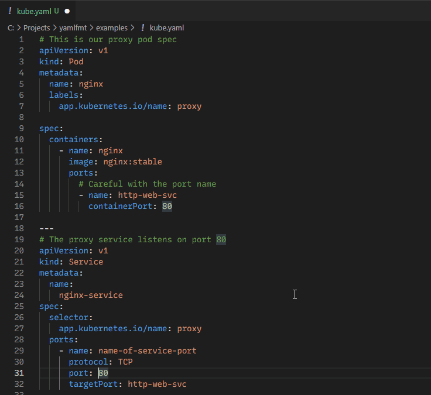

# YAMLfmt for Visual Studio Code

YAMLfmt is a compact, efficient, and **comment-preserving** YAML formatter built on top of [kubernetes-sigs/yaml](https://github.com/kubernetes-sigs/yaml) and [go-yaml](https://github.com/go-yaml/yaml) — the same core code used by [kubectl](https://kubernetes.io/docs/reference/kubectl/kubectl/).

#### Why this matters

1. It ensures consistency with manifests generated by many popular tools: kubectl, kustomize, helm, etc.
1. It eliminates code churn with [competing formatters](https://github.com/prettier/prettier/issues/12385#issuecomment-1147958026)/styles.

#### But I write YAML for humans, not machines!

Absolutely! That's why YAMLfmt preserves comments, allowing you to communicate and collaborate using meaningful _words_ 😍.

## Features

Here's what YAMLfmt offers:

 - Format Document
 - Format Selection

You can also configure VSCode to format on save.

## Extension Settings

This extension provides the following settings:

* `yaml.compactSequenceStyle` — Controls whether arrays are indented an additional level.

## Known Issues

Currently, there are no known issues.

## Release Notes

### 1.0.0

Initial release of YAMLfmt.

### For more information

* [YAMLfmt](http://github.com/melt-inc/yamlfmt)
* [YAML](https://yaml.org/)

Enjoy! **[Melt Inc.](https://github.com/melt-inc)**
